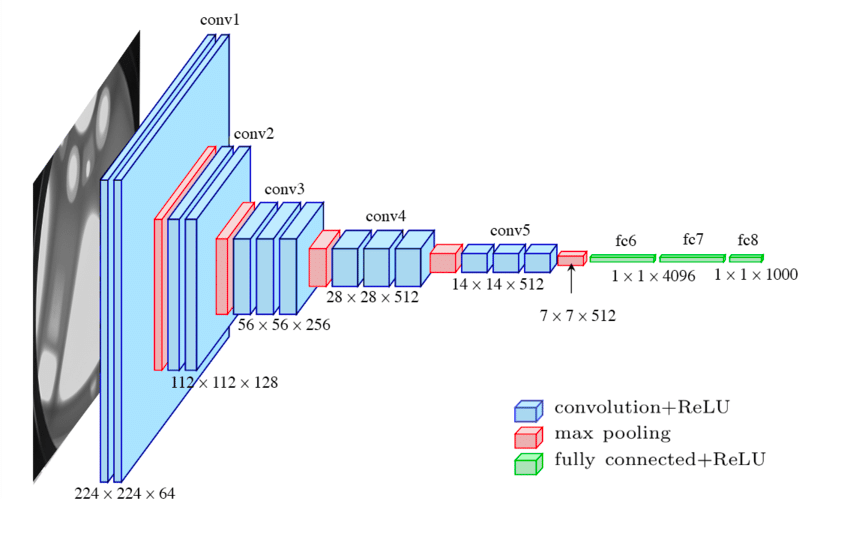

# X-Ray Pneumonia
Deep Learning model on dataset of chest X-Ray's.  

This model will classify images in two classes: not infected, and pneumonia.

## Dataset:
https://www.kaggle.com/datasets/paultimothymooney/chest-xray-pneumonia

5'863 images in 2 categories.

The two categories are: NORMAL, PNEUMONIA

Example:

The images are rescaled to 400x400 pixels automatically using keras image_dataset_from_directory function.  
I chose 400x400 pixels because it is a good compromise between training speed and preciseness, since on this dataset, the model needs a lot of precision in order to detect the pneumonia. Also, my equipment isn't powerful enough to do more pixels.

## The model:

The model I used is a copy of the VGG-19 model.  
  
This model is frequently used in CNN research. I chose this architecture because I wanted to explore something different from traditional CNN neural networks.  
I hesitated with ResNet, because both architectures are known for their efficiency on CNN datasets, but went for VGG-19 as it is used in medical image recognition, which is today's topic.  

## How I proceeded

I went through 3 steps before having a decent result.  
- Firstly, I tried to train the model using a very basic CNN neural network in test_0.py. The training set accuracy became very good after a few epochs, but the test set accuracy stayed completely random. It became clear that this type of neural network was not complex enough to detect small changes in peoples lungs.  
- However, I still kept trying to make it work by just adding Dense layers, making the learning rate smaller, and adding pixels to the image (started off with 256x256). It still didn't have conclusive results, as the test set accuracy stayed random.  
- I finally looked up what more complex neural networks I could use to make this work, and saw someone talking about VGG-19. And the current version of the model, in test_1.py, made far better results.  
